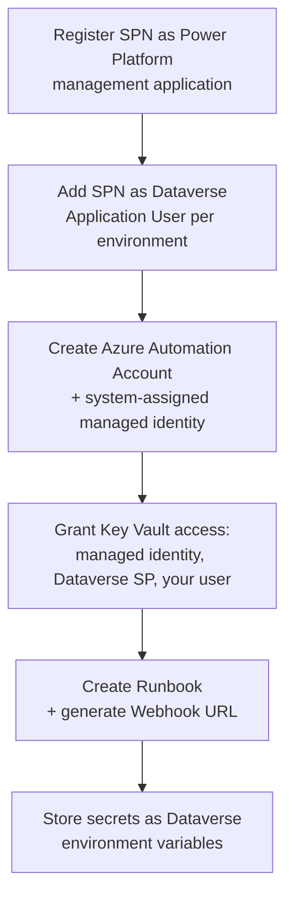
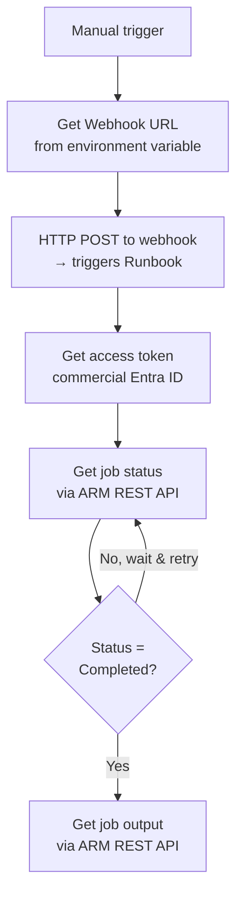

# Azure Automation Runbook – Prerequisites

This document describes everything that must be in place before the runbook and its triggering Power Automate flow can be created and run.

---

## Overview

The runbook is triggered by a Power Automate flow via an HTTP webhook. When triggered, it authenticates to Power Platform as a service principal (SPN) and adds an Application User to one or more Dataverse environments automatically. The flow then polls the runbook job status and retrieves its output.

**Setup (one-time, done before the flow ever runs):**

**The Power Automate flow itself:**

> **Cloud clarification:** This customer's GCC tenant is **GCC (moderate)**, not GCC High or DoD. GCC moderate runs on **commercial Entra ID and ARM endpoints** (`login.microsoftonline.com`, `management.azure.com`) — not `.us` gov endpoints. However, PAC CLI and Power Platform Admin PowerShell still target GCC-specific Power Platform/Dataverse endpoints (`--cloud UsGov`, `-Endpoint usgov`, `.crm9.dynamics.com`). Do not assume these two things use the same cloud designation — verify which layer (Entra/ARM vs. Power Platform/Dataverse) you're authenticating to before picking an endpoint.

---

## 0. Register Microsoft.PowerPlatform Resource Provider

Before creating any Secret-type environment variable in Power Platform, register the `Microsoft.PowerPlatform` resource provider on the Azure subscription that hosts the Key Vault.

1. Azure portal → your subscription → **Resource providers**
2. Search for `Microsoft.PowerPlatform`
3. If status is not **Registered**, select it and click **Register**

> **Important:** If this provider is registered *after* an environment variable is created, the environment variable can appear to save successfully but silently fail to resolve the secret at runtime, producing an error like `Value cannot be null. Parameter name: input` when the flow runs. If you hit this error and later register the provider, delete and recreate the environment variable — re-registering the provider alone does not fix an already-broken reference.

Also confirm the Key Vault's networking allows access:
- **Networking → Allow public access from all networks**, or
- If using a firewall, explicitly allow Power Platform IP ranges (Power Platform is not covered by "Trusted Services Only")

---

## 1. Resource Group

Create (or identify) an Azure Resource Group to contain the Automation Account and Key Vault used by this solution.

1. Azure portal → **Resource groups** → **Create**
2. Choose the subscription and a region (any commercial Azure region — GCC moderate does not require a GovCloud subscription)
3. Name it following your naming convention (e.g. `rg-nh-doit`)

---

## 2. Azure Automation Account

Create an Azure Automation Account in the Resource Group created above.

| Setting | Value |
|---|---|
| Runtime version | PowerShell 7.2 |
| Region | Same as the Resource Group |
| Managed Identity | System-assigned (required) |

Name it following your naming convention (e.g. `aa-nh-doit`).

---

## 3. Key Vault Access — Three Separate Grants Required

A single Key Vault is used to store the SPN client secret. Three different identities need access to it, and each is granted separately. Missing any one of these produces a different failure at a different stage, so confirm all three.

| Who needs access | Role | Where to grant it |
|---|---|---|
| Automation Account's system-assigned managed identity | Key Vault Secrets User | Key Vault → Access control (IAM) |
| Dataverse service principal (appears as "Dataverse" — search by name, not App ID, as the App ID differs by tenant/cloud) | Key Vault Secrets User | Key Vault → Access control (IAM) |
| Your own user account (to create the environment variable in the maker portal) | Key Vault Secrets User | Key Vault → Access control (IAM) |

**Finding the Automation Account's managed identity:**
Automation Account → **Identity → System assigned** → copy the Object (principal) ID.

**Finding the Dataverse service principal:**
In the role assignment "Select members" search box, search **"Dataverse"**. Do not search by App ID — the well-known commercial App ID (`00000007-0000-0000-c000-000000000000`) does not necessarily match what appears in a GCC tenant. Confirm by name.

---

## 4. Required PowerShell Modules (Automation Account)

Install these modules in the Automation Account under **Modules → Add a module → Browse the gallery**:

| Module | Purpose |
|---|---|
| `Microsoft.PowerApps.Administration.PowerShell` | Registering the management application; PAC CLI is a separate executable (see Section 7) |
| `Az.Accounts` | `Connect-AzAccount -Identity` for managed identity auth |
| `Az.KeyVault` | `Get-AzKeyVaultSecret` |

---

## 5. Automation Account Variables

Create the following under **Shared Resources → Variables**:

| Variable Name | Type | Encrypted | Value |
|---|---|---|---|
| `TenantId` | String | No | Entra tenant ID (GUID) |
| `AppId` | String | No | SPN application (client) ID |
| `KeyVaultName` | String | No | Name of the Key Vault storing the SPN secret |
| `KeyVaultSecretName` | String | No | Name of the secret within the Key Vault |

The client secret itself is never stored as an Automation variable — it is retrieved from Key Vault at runtime using the managed identity.

---

## 6. SPN Prerequisites (Power Platform side)

| Prerequisite | Script | Who runs it |
|---|---|---|
| Registered as a Power Platform management application | `1-register-management-app.ps1` | Human Power Platform Administrator, run once |
| Added as a Dataverse Application User with System Administrator role in each target environment | `2-add-app-user.ps1` | Human Power Platform Administrator, run once per environment set |

Both scripts use `Add-PowerAppsAccount -Endpoint usgov` and `pac auth create --cloud UsGov` — these are correct for GCC moderate's Power Platform/Dataverse layer, despite the Entra/ARM layer being commercial (see the cloud clarification note above).

---

## 7. PAC CLI in the Runbook

PAC CLI is a standalone executable, not a PowerShell module, and is not available in the Azure Automation sandbox by default. The runbook installs it at runtime:

1. Installs .NET 10 via `dotnet-install.ps1`
2. Installs PAC CLI via `dotnet tool install --global Microsoft.PowerApps.CLI.Tool`

This adds roughly 1–2 minutes to each runbook execution. For frequent or production use, consider a **Hybrid Runbook Worker** with .NET and PAC CLI pre-installed instead of installing at runtime.

---

## 8. SPN Role Assignment on the Automation Account (for job status polling)

If the Power Automate flow polls the runbook's job status/output via the ARM REST API (rather than only firing the webhook and walking away), the SPN needs an RBAC role on the Automation Account itself — this is separate from anything configured in Power Platform or Key Vault.

**Automation Account → Access control (IAM) → Add role assignment**

| Field | Value |
|---|---|
| Role | Automation Job Operator |
| Assign access to | Service principal |
| Member | the SPN |

Without this, polling fails with: `does not have authorization to perform action 'Microsoft.Automation/automationAccounts/jobs/read'`.

---

## 9. Webhook

1. Runbook → **Webhooks** → **Add webhook**
2. Set an expiry date per your organization's policy
3. **Copy the webhook URL immediately** — it is shown only once
4. Store it as a Secret-type Dataverse environment variable (see Section 10) — never hardcode it in the flow

---

## 10. Secrets in Power Automate Flows

Never hardcode Client ID, Client Secret, Tenant ID, or webhook URLs directly in flow actions. Use Dataverse environment variables instead.

| Value | Environment Variable | Type |
|---|---|---|
| Webhook URL | `nh_WebhookUrl` | Secret |
| SPN Client Secret | `nh_SpnClientSecret` | Secret |
| SPN App ID | `nh_SpnAppId` | Secret |

**Retrieving Secret-type variables:**
Dataverse connector → **Perform an unbound action** → Action Name `RetrieveEnvironmentVariableSecretValue`, passing the schema name as `EnvironmentVariableName`. This requires Section 0 (resource provider registration) and Section 3 (Key Vault access for the Dataverse service principal) to already be in place.

**Additional steps:**
- Enable **Secure Inputs/Outputs** (action Settings tab) on any HTTP action that references a secret, even indirectly, so values don't appear in run history.

---

## 11. Power Automate Flow — Token Acquisition for ARM Calls (GCC moderate)

If the flow calls the ARM REST API (job status/output polling), acquire the token manually rather than relying on the built-in **Active Directory OAuth** authentication type, unless you've confirmed it works with commercial endpoints for your tenant. Since GCC moderate uses commercial Entra ID/ARM, use:

| Field | Value |
|---|---|
| Token URI | `https://login.microsoftonline.com/{tenantId}/oauth2/token` |
| Body | `grant_type=client_credentials&client_id={appId}&client_secret={secret}&resource=https://management.azure.com/` |

Subsequent ARM calls (job status, job output) use:
- Authentication type: **Raw**
- Value: `Bearer {access_token}`
- URIs use `management.azure.com`, not `management.usgovcloudapi.net`

---

## 12. Power Automate Flow — HTTP Action to Trigger the Webhook

The flow must call the webhook using the **HTTP** action (not the Azure Automation connector, which is not supported in GCC).

| Setting | Value |
|---|---|
| Method | POST |
| URI | webhook URL, retrieved from `nh_WebhookUrl` (see Section 10) |
| Headers | `Content-Type: application/json` |
| Body | `{}` (or environment payload, depending on runbook version) |

> GCC Dataverse environment URLs use `.crm9.dynamics.com`, not `.crm.dynamics.com` (commercial).

---

## 13. Do Until Loop Logic (Job Status Polling)

If polling for job completion, the **Loop until** condition must be:

`JobStatus` **is equal to** `Completed`

Not "is not equal to" — a Do Until loop runs until the condition becomes **true**, so an incorrect operator here causes the loop to exit after a single iteration without actually waiting for the job to finish.

---

## Summary Checklist

- [ ] `Microsoft.PowerPlatform` resource provider registered on the subscription
- [ ] Key Vault networking allows Power Platform access
- [ ] Azure Automation Account created (PowerShell 7.2, system-assigned managed identity)
- [ ] Key Vault Secrets User granted to: Automation Account managed identity, Dataverse service principal, your own user
- [ ] Required PowerShell modules installed in Automation Account
- [ ] Automation Account variables created (`TenantId`, `AppId`, `KeyVaultName`, `KeyVaultSecretName`)
- [ ] SPN registered as Power Platform management application (`1-register-management-app.ps1`)
- [ ] SPN added as Dataverse Application User in each target environment (`2-add-app-user.ps1`)
- [ ] Automation Job Operator role granted to SPN on the Automation Account (for job polling)
- [ ] Runbook created (`3-runbook.ps1` pasted in) and webhook generated
- [ ] Webhook URL stored as Secret-type environment variable (`nh_WebhookUrl`)
- [ ] SPN Client Secret and App ID stored as environment variables (`nh_SpnClientSecret`, `nh_SpnAppId`)
- [ ] Power Automate HTTP action configured to trigger webhook
- [ ] Power Automate token-acquisition + ARM polling actions configured with commercial endpoints (GCC moderate)
- [ ] Do Until loop condition set to "is equal to Completed"